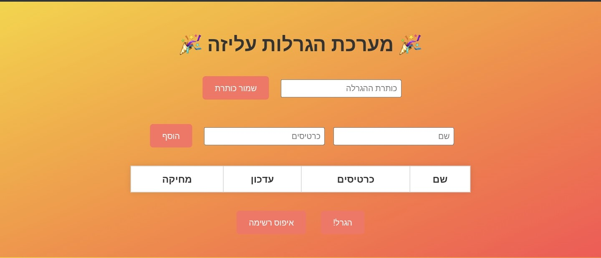

# מערכת הגרלות עליזה

אפליקציית ווב פשוטה ונעימה להגרלות מבוססות כרטיסים. ניתן להוסיף משתתפים, לקבוע מספר כרטיסים לכל אחד, לבצע הגרלה ולהכריז על הזוכה עם אפקט קונפטי.

## תכונות עיקריות

- ממשק צבעוני, תומך בעברית ובכיוון RTL
- אפשרות לשמור כותרת להגרלה
- הוספה, עריכה ומחיקה של משתתפים
- שמירה אוטומטית ב-LocalStorage
- הגרלה לפי כמות כרטיסים (ככל שיש יותר כרטיסים – הסיכוי לזכייה גדול יותר)
- חלון קופץ להצגת הזוכה עם קונפטי
- מותאם למובייל

## קבצים

- `index.html` – דף ראשי של האתר
- `css/style.css` – עיצוב ותצוגה
- `js/script.js` – לוגיקה של האפליקציה
- `images/icon.ico` – אייקון של האתר (מדליה)

## איך להריץ

1. העלה את כל הקבצים ל-GitHub.
2. ודא שהקבצים נשמרו בתיקיות:
   - קובץ HTML בתיקיה הראשית
   - קובצי CSS ו-JS בתוך `css/` ו-`js/`
   - האייקון בתיקיה `images/`
3. הפעל GitHub Pages דרך ההגדרות של הריפוזיטורי.
4. פתח את הקישור שהתקבל – ותהנה!

## תצוגה

## רישיון

פרויקט זה פתוח לשימוש חופשי לכל מטרה, אישית או לימודית.
